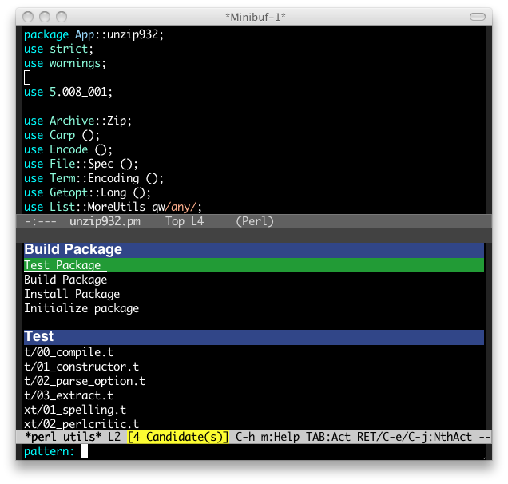

# perl-utils.el

## Introduction
`perl-utils.el` is Emacs perl utilities.

## Requirements

* Emacs 24 or higher
* helm 1.0 or higher
* Perl

## Basic Usage

#### `perl-utils`

`perl-utils` provides building package and testing package.
